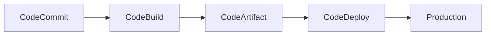

**(참조) CI/CD AWS 서비스들**

(면접관) 개발 시 사용하는 CI/CD 개념이 뭔지 설명해줄래요? 프로젝트 개발 시 어떤 CI/CD 솔루션들을 사용해봤고 사용 시 어떤 기능들이 유익했나요?

### CI/CD 및 GitHub 기본 개념

| 용어 | 설명 |
| --- | --- |
| **CI (Continuous Integration)** | - 코드 변경사항을 주기적으로 빌드/테스트하여 통합하는 프로세스   - 버그를 신속하게 발견하고 품질 개선 |
| **CD (Continuous Delivery/Deployment)** | - **Delivery**: 프로덕션 배포 준비가 된 상태 유지   - **Deployment**: 프로덕션 환경까지 자동 배포 |

### AWS CI/CD 서비스 비교

| 서비스 | 주요 기능 | 사용 사례 | 특징 |
| --- | --- | --- | --- |
| **CodeCommit** | - 프라이빗 Git 저장소   - 완전 관리형   - AWS 서비스 통합 | - 소스 코드 관리   - 버전 관리   - 팀 협업 | - IAM 통합   - 암호화   - 고가용성 |
| **CodeBuild** | - 완전 관리형 빌드 서비스   - 다양한 빌드 환경 지원   - 병렬 빌드 | - 코드 컴파일   - 테스트 실행   - 패키지 생성 | - 분당 과금   - 확장 자동화   - 사용자 정의 가능 |
| **CodeDeploy** | - 자동화된 배포   - 다양한 컴퓨팅 서비스 지원   - 롤백 기능 | - EC2 배포   - Lambda 배포   - ECS 배포 | - 점진적 배포   - 트래픽 이전   - 배포 상태 추적 |
| **CodePipeline** | - 파이프라인 오케스트레이션   - 자동화된 릴리스 프로세스   - 다양한 통합 지원 | - CI/CD 파이프라인   - 자동 릴리스   - 워크플로우 관리 | - 시각적 워크플로우   - 사용자 정의 작업   - 이벤트 기반 실행 |
| **CodeArtifact** | - 아티팩트 관리   - 패키지 저장소   - 종속성 관리 | - Maven/npm 저장소   - 라이브러리 관리   - 패키지 공유 | - 프라이빗 저장소   - 버전 관리   - IAM 통합 |
| **CodeGuru** | - 코드 리뷰 자동화   - 성능 최적화 추천   - ML 기반 분석 | - 코드 품질 개선   - 성능 최적화   - 보안 검사 | - ML 기반 분석   - 실시간 추천   - 자동화된 리뷰 |

### 일반적인 AWS CI/CD 파이프라인 예시

### AWS CI/CD 서비스 주요 장점

1. **통합성**
    - AWS 서비스들과 긴밀한 통합
    - IAM을 통한 통합 보안 관리
    - CloudWatch를 통한 모니터링
2. **확장성**
    - 자동 확장/축소
    - 병렬 처리 지원
    - 글로벌 배포 가능
3. **관리 용이성**
    - 완전 관리형 서비스
    - 서버리스 운영
    - 자동화된 워크플로우
4. **비용 효율성**
    - 사용한 만큼만 지불
    - 리소스 자동 최적화
    - 유휴 자원 최소화

### 주요 CI/CD 솔루션 비교 (GitHub, AWS, Jenkins)

| 항목 | **GitHub Actions** | **AWS CI/CD 서비스** | **Jenkins** |
| --- | --- | --- | --- |
| **유형** | SaaS | SaaS | 오픈소스 |
| **호스팅** | 클라우드 | AWS 클라우드 | Self-hosted |
| **주요 특징** | - GitHub 통합   - YAML 기반 설정   - 마켓플레이스   - 워크플로우 자동화 | - AWS 서비스 통합   - 서버리스   - CodeCommit/Build/Deploy/Pipeline   - 완전 관리형 | - 풍부한 플러그인   - 높은 커스터마이징   - 다양한 통합 지원   - 파이프라인 스크립트 |
| **가격 정책** | - Public 레포 무료   - Private 레포 유료   - 분당 과금   - 스토리지 용량별 과금 | - 사용량 기반 과금   - 서비스별 별도 과금   - Free Tier 제공 | - 무료   - 인프라 비용만 발생   - 플러그인 별도 구매 가능 |
| **장점** | - GitHub와 완벽한 통합   - 쉬운 설정   - 즉시 사용 가능   - 다양한 액션 템플릿 | - AWS 서비스 통합   - 높은 확장성   - 관리 부담 없음   - 보안성 | - 완전한 커스터마이징   - 풍부한 플러그인   - 커뮤니티 지원   - 벤더 종속성 없음 |
| **단점** | - GitHub 종속   - 확장성 제한   - 복잡한 워크플로우   - 고급 기능 유료 | - AWS 종속   - 복잡한 설정   - 높은 학습 곡선   - 비용 예측 어려움 | - 관리 부담 큼   - 초기 설정 복잡   - 인프라 유지 필요   - 보안 설정 필요 |
| **보안** | - GitHub 보안 기능   - Secrets 관리   - RBAC | - IAM   - KMS   - VPC   - CloudTrail | - 플러그인 기반 보안   - 자체 보안 설정   - 인증/인가 |
| **확장성** | - 제한된 확장   - 마켓플레이스 의존 | - 자동 확장   - 글로벌 리전   - 무제한 확장 | - 무제한 확장   - 클러스터 구성   - 분산 빌드 |

### 사용 환경별 추천

| 환경 | 추천 솔루션 | 이유 |
| --- | --- | --- |
| **스타트업** | GitHub Actions | - 빠른 시작   - 적은 관리 부담   - GitHub 통합 |
| **AWS 기반 서비스** | AWS CI/CD | - AWS 서비스 통합   - 관리형 서비스   - 보안성 |
| **엔터프라이즈** | Jenkins | - 완전한 제어   - 커스터마이징   - 보안 정책 준수 |
| **하이브리드 환경** | Jenkins | - 다양한 환경 지원   - 유연한 구성   - 멀티 클라우드 |

### 비용 비교 예시

(팀 10명, 월간 500회 빌드 기준)

| 솔루션 | 예상 월 비용 | 비고 |
| --- | --- | --- |
| GitHub Actions | $40-100 | - Private 레포   - 빌드 시간에 따라 변동 |
| AWS CI/CD | $100-300 | - 서비스 조합에 따라 변동   - 리소스 사용량 기준 |
| Jenkins | $50-200 | - 인프라 비용만 해당   - 서버 사양에 따라 변동 |

### GitHub vs AWS CI/CD 서비스 비교

| 기능 | **GitHub** | **AWS 서비스** |
| --- | --- | --- |
| **소스 코드 관리** | GitHub | CodeCommit |
| 버전 관리 | Git | Git |
| 프라이빗 레포 | 유료 | 완전 관리형 |
| 저장소 크기 | 무제한 | 무제한 |
| 파일 크기 제한 | 100MB | 2GB |
| IAM/권한 관리 | 자체 권한 시스템 | AWS IAM 통합 |

| **CI/CD 기능** | GitHub Actions | AWS CI/CD |
| --- | --- | --- |
| 빌드 자동화 | O | CodeBuild |
| 배포 자동화 | O | CodeDeploy |
| 파이프라인 관리 | O | CodePipeline |
| 아티팩트 관리 | GitHub Packages | CodeArtifact |
| 컨테이너 지원 | O | O |
| 서버리스 지원 | 제한적 | 완전 지원 |

| **통합 기능** | GitHub | AWS 서비스 |
| --- | --- | --- |
| 이슈 트래킹 | O | 외부 통합 필요 |
| 위키 | O | X |
| 코드 리뷰 | O | CodeGuru |
| Pull Request | O | O |
| 웹훅 | O | EventBridge 통합 |

| **보안 기능** | GitHub | AWS 서비스 |
| --- | --- | --- |
| 암호화 | O | KMS 통합 |
| SAML/SSO | Enterprise | AWS SSO |
| IP 제한 | Enterprise | VPC 엔드포인트 |
| 취약점 스캔 | Dependabot | Amazon Inspector |

| **모니터링** | GitHub | AWS 서비스 |
| --- | --- | --- |
| 로깅 | 제한적 | CloudWatch |
| 메트릭 | 기본 | CloudWatch |
| 알림 | O | SNS/EventBridge |

| **가격 정책** | GitHub | AWS 서비스 |
| --- | --- | --- |
| 기본 요금 | 사용자당 과금 | 사용량 기반 |
| 무료 티어 | O | Free Tier |
| CI/CD 과금 | 분당 | 사용량 기반 |

### AWS CI/CD 서비스의 주요 장점

1. **AWS 서비스 통합**
   - AWS 리소스와 긴밀한 통합
   - IAM을 통한 중앙화된 접근 제어
   - AWS 서비스 간 원활한 연동

2. **엔터프라이즈 확장성**
   - 글로벌 리전 지원
   - 대규모 동시 빌드/배포
   - 자동 확장/축소

3. **보안**
   - KMS 암호화
   - VPC 통합
   - IAM 상세 권한 제어
   - 감사 로그 (CloudTrail)

4. **비용 최적화**
   - 사용량 기반 과금
   - 자동 스케일링
   - 리소스 최적화

### AWS CI/CD 서비스의 주요 단점

1. **학습 곡선**
   - AWS 서비스 이해 필요
   - 복잡한 설정 필요

2. **통합 기능 제한**
   - 이슈 트래킹 부재
   - 위키 기능 부재
   - 외부 도구 통합 필요

3. **비용 예측**
   - 복잡한 과금 구조
   - 여러 서비스 사용 시 비용 증가 가능

